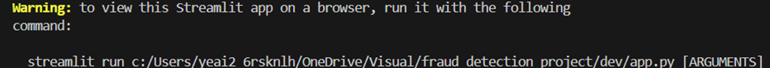

This is a Streamlit app for detecting fraudulent transactions.

## Quick Start Guide
1.	Open zip file in your IDE (I used VS Code).

2.	Install dependencies “pip install -r requirements.txt”.

3.	Folder “model” should have models if not run “train_model.py”.

4.	Run “app.py”. If no pop-up tab for streamlit happens, then look at the terminal for a command and copy and run that command.  Example: 

5.	Login with 
    Username: admin
    Password: admin123

6.	Loading data does take a little while, so please be patient and enjoy. 